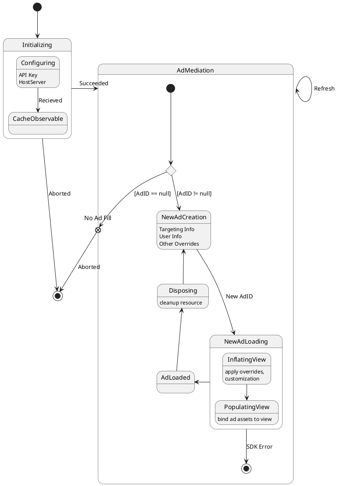
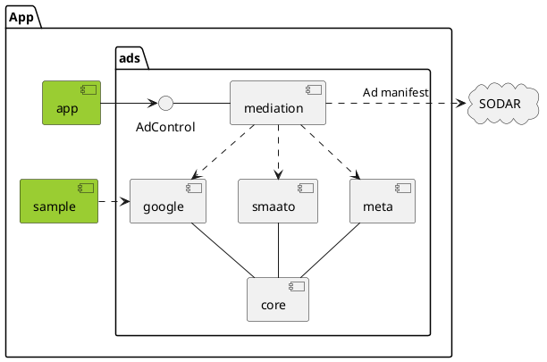

# 2024-12-23

## 📚 오늘 배운 내용
- 모든 클래스 타입들의 연산자 오버로딩을 통해 더욱 의도에 가깝도록 수정할수 있다.
    - 대입연산자는 오버로딩이 불가능하다. 하지만, 연산후 대입하는 연산자들은 오버로딩이 가능하다.
    - 대입연산자 대신 대리자를 통해 간접적으로 비슷한 목적을 달성할 수 있다.

- plantUML의 다이어그램 만드는 문법 복습

## 💻 예제

과거에 만들었던 프로젝트의 코드를 샘플로 plantuml을 만들어 봤습니다.

## 🔍 참고 자료
- [PlantUML Docs](https://plantuml.com/class-diagram)

## ❓ 궁금한 점
- 속성을 액세스 하는 대신 대리자를 통해 원하는 값에 직접 접근하는 설정이 가능하긴 한것인지 잘 모르겠습니다.
- target: Actor?의 널여부를 체크 했음에도 바로 다음줄에서 !!를 붙이지 않으면 에디터가 불평을 합니다.
- 클래스, 메소드의 시그니처만으로 plantuml 코드를 자동으로 만들어주는 방법을 조사해봐야 겠습니다.(주석을 통하는 방법도 괜찮아 보입니다.)
- 메소드 오버라이딩을 했을때 super.method() 호출을 강제하는 문법이 존재하는지
