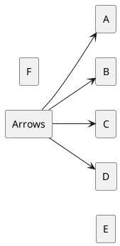
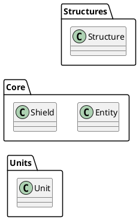

# 2024-12-26 
## 📚 오늘 배운 내용
- Puml이용한 프로젝트 과제  
- 스타크래프트 객체지향으로 만들기

### Puml 사용시 Tip
> 복잡한 구조로 인해 가독성이 떨어지는 부분을 보완
1. 정렬 방법
- left to right direction -> 왼쪽부터 오른쪽으로 정렬
- top to bottom direction -> 기본셋팅으로 위에서 부터 아래로 정렬됨

- [hidden] 을 적절히 이용하면 interface등 동시에 이용하는 부분은 적당히 생략해서 깔끔하게 생략된다.

2. package
> class로만 보여주기에는 각 단계별로 Box를 넣어서 그룹을 나누어 보여주고 싶었다.
- package로 이름을 넣어주고 적당히 그룹화 해서 보여준다.
- 그 그룹으로 화살표를 그려줄수도 있다.
- 또한 그룹안에 class로도 화살표를 그려줄수 있다.
* 주의할점은  extends 해서 연결시켜줘도 된다.

### 객체지향 구조설계
- class 구조설계를 할때 상위개념 보다는 하위개념을 먼저 생각하는게 유연한 설계가 가능하다.
- 한번에 모든 케이스를 생각하기 보다는 그룹을 나눠서 한 그룹씩 나눠서 세세하게 많은 케이스들을 생각하면서 진행하는게 좋다. 

## 📔 회고
- 절차지향으로 Top to Down 으로 생각하는 버릇이 있던거 같다.
- Puml을 이용해서 토론을 통해 설계하니 더 좋은 결과물이 나오고 좀더 탄탄한 베이스가 만들어진거 같다.

## 참고자료
- [puml guide](https://crashedmind.github.io/PlantUMLHitchhikersGuide/layout/layout.html)
