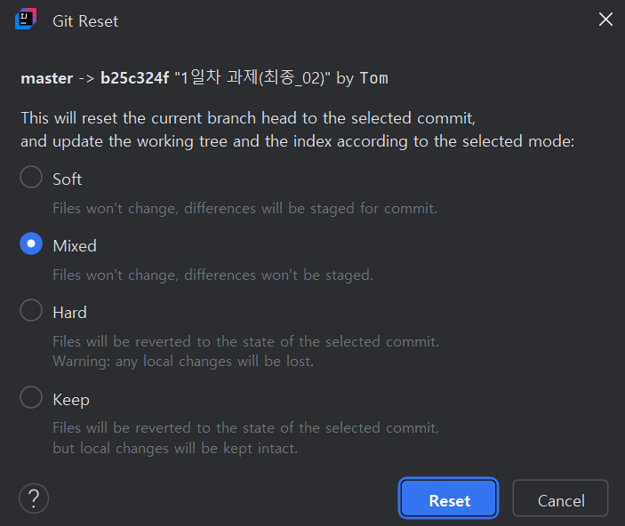

# git study

## git 사용 전 알아두어야할 git의 구조 및 기능
- repository는 local과 server 두 공간이 있다.
- local과 fork된 repository은 개인 공간으로 생각하면 될 듯 하다.
- 실제로 작업(협업)이 이루어지는 repository에만 최종적인 결과를 제출하면된다.
- server가 바로 본인이 작업하는 repository라면 local에서 push로 제출하는 구조가 되겠고,
 fork로 가져온 repository라면 pull request를 하여서 작업을 올려주면 된다.
  (그렇게 하면 해당 repository 관리자가 확인 후 repository를 수정하는 구조인 듯 하다.)

## git 사용을 위한 일련의 과정
- 우선 local에 repository를 만든다.
- server의 repository를 만들거나 다른 repository를 fork 한다.
- 이렇게 server의 repository를 만들었으면 local과 remote를 시켜준다.
- 에러사항) 사용하기 전에 pull로 repository를 당겨온 후 먼저 push가 이루어져야한다.
 그렇지 않으면 server와 local의 repository가 따로 놀게 되는데 
 이 경우 각 툴의 commit tree로 들어가 rebase 명령어 혹은 설정으로 local의 기록들을 연결시켜
 server와 local의 repository 구성을 일치시켜 주면 된다.
---

# git command

## git branch
### 개념
- main 작업에 branch로 분기를 만들어서 작업이 가능.
- 각 branch는 다른 branch나 main에 독립적임.

예시\)
```
// create branch
git branch [name of branch]

// delete branch
git branch -d [name of branch]
```
---
## git checkout
### 개념
- 선택한 branch로 작업 공간을 이동시킨다.

예시\)
```
git checkout [name of branch]
```
---
## git merge
### 개념
- 현재 작업 중인 branch에 다른 branch를 구축한다.

예시\)
```
git merge [name of branch]
```
설명\) 현재 선택 하고 있는 branch에 merge한 branch가 구축이 된다.


---
## git rebase
### 개념
- 다른 branch 위에 현재 작업 중인 branch를 구축한다.

예시\)
```
git rebase [name of branch]
```
설명\) rebase 하려는 branch 위에 현재 선택한 branch를 구축한다.

---
## git fetch
### 개념
- pull 하기 전에 이력만을 살펴볼 수 있는 명령어.

예시\)
```
git fetch [name of repository]

설명) 
   fetch로 선택한 repository의 이력만을 가져온다.
   pull 명령어는 fetch와 merge를 같이 수행해 주는 명령어라고 볼 수 있다.
```
---
## git reset
### 개념
- commit 이력을 과거 특정 지점으로 돌려놓는다.

예시\)

설명\) git commit 이력 구조에서 특정 commit 지점을 우클릭 후 reset 항목을 눌러주면
위와 같은 옵션 선택이 나온다.


Mixed: 현재 작업을 유지한 채 commit만 과거 시점으로 돌아가고,  
Hard: 작업도 같이 과거 commit 지점으로 돌아간다.

활용\)  
Mixed: commit message를 수정하고자 할 때.  
Hard: 작성한 코드 및 문서를 다시 과거 시점으로 되돌리고자 할 때.